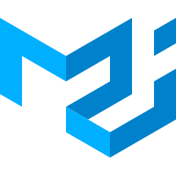

 

# Hi, I’m [Anthony](https://anthonyzhang.netlify.app/), a motivated Frontend Engineer based in New York City.

### 🌱 I’m currently preparing for code interviews and working on a few projects.

### 🌱 2022 Goal: Find a full time job in Frontend Engineer and contribute more to Open Source projects

### 🌱 Fun fact: I like music a lot and love to compose music and play piano.

### 📫 How to reach me. Email: anthonyzhang1997@gmail.com

## Featured Projects:

### 1. [Portfolio](https://github.com/AnthonyZhang220/portfolio-website)

### 2. [Gaggle](https://github.com/AnthonyZhang220/google-search-clone)

### 3. [TripAdvisor](https://github.com/AnthonyZhang220/travel-advisor)

### 4. [LaoMa Spicy](https://github.com/AnthonyZhang220/qrcode-ordering)

### 5. [Explore Amazon API](https://github.com/AnthonyZhang220/Find_GPU_API)

## Connect with me:

[][linkedin]

[][stackoverflow]

[][github]

[][medium]

## Languages, Tech Stacks and Tools:

[][]

[][]

[][]

[][]

[][]

[][]

[][]

[][]

[][]

[][]

[][]

[][]

[][]

---

[linkedin]: https://www.linkedin.com/in/anthony-xiangyu-zhang/
[stackoverflow]: https://stackoverflow.com/users/6162027/anthonydev220
[portfolio]: https://anthonyzhang.netlify.app/
[medium]: https://medium.com/@anthonyzhang220
[github]: https://github.com/AnthonyZhang220

<!---
AnthonyZhang220/AnthonyZhang220 is a ✨ special ✨ repository because its `README.md` (this file) appears on your GitHub profile.
You can click the Preview link to take a look at your changes.
--->
